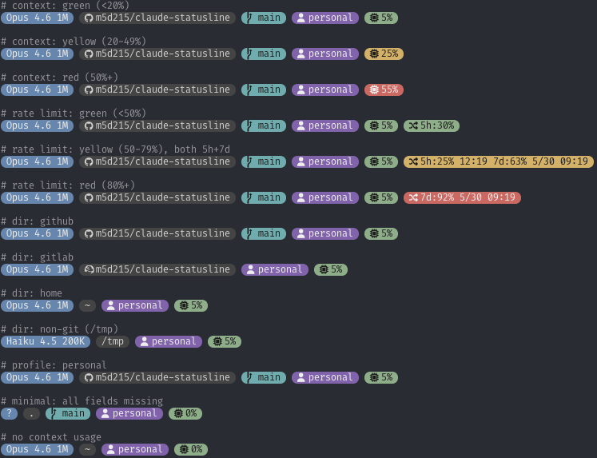
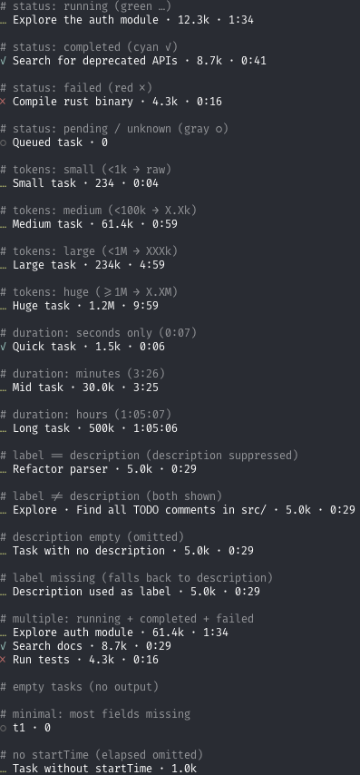

# claude-statusline

A Powerline-style status line and subagent panel renderer for [Claude Code](https://claude.ai/code), written as single [jq-jit](https://github.com/m5d215/jq-jit) programs.

## Main status line



| Segment | Description |
|---------|-------------|
| Model | Claude model name and context window size |
| Directory | Current working directory (`~/src/github.com/` and `~/src/gitlab.com/` are shortened with icons) |
| Git branch | Current branch (hidden when not in a git repo) |
| Profile | Basename of `$CLAUDE_CONFIG_DIR` (hidden when unset or `~/.claude`) |
| Context % | Context window usage — green → yellow → red as it fills |
| Rate limits | 5-hour and 7-day usage with reset time (hidden when no data) |

## Subagent status line

Renders each task row in Claude Code's subagent panel.



Each row is `{icon} {label} [· {description}] · {tokens} [· {elapsed}]`.

| Field | Behaviour |
|-------|-------------|
| Status icon | `…` running (green) · `✓` completed (cyan) · `✗` failed (red) · `○` other (gray) |
| Label | Falls back through `label` → `description` → `id` |
| Description | Only shown when it differs from the label |
| Tokens | `234` (raw) / `61.4k` / `234k` / `1.2M` |
| Elapsed | `M:SS` or `H:MM:SS`; omitted when `startTime` is missing |

## Requirements

- macOS (Linux is not currently supported)
- [jq-jit](https://github.com/m5d215/jq-jit) — a jq interpreter with `exec`/`execv` builtins
- [Nerd Font](https://www.nerdfonts.com/) — for Powerline and icon glyphs in the main status line
- [Claude Code](https://claude.ai/code)

## Installation

### Homebrew (recommended)

```sh
brew install m5d215/tap/claude-statusline
```

This pulls in [jq-jit](https://github.com/m5d215/jq-jit) automatically and installs both `claude-statusline` and `claude-subagent-statusline` on your `PATH`.

Then add to your `~/.claude/settings.json`:

```json
{
  "statusLine": {
    "type": "command",
    "command": "claude-statusline",
    "padding": 0
  },
  "subagentStatusLine": {
    "type": "command",
    "command": "claude-subagent-statusline"
  }
}
```

### Manual

**1. Install [jq-jit](https://github.com/m5d215/jq-jit)** (via Homebrew, `cargo install`, or a release binary).

**2. Download the scripts**

```sh
curl -o ~/.claude/statusline.sh https://raw.githubusercontent.com/m5d215/claude-statusline/main/statusline.sh
curl -o ~/.claude/subagent-statusline.sh https://raw.githubusercontent.com/m5d215/claude-statusline/main/subagent-statusline.sh
chmod +x ~/.claude/statusline.sh ~/.claude/subagent-statusline.sh
```

**3. Configure Claude Code**

Add to your `~/.claude/settings.json`:

```json
{
  "statusLine": {
    "type": "command",
    "command": "~/.claude/statusline.sh",
    "padding": 0
  },
  "subagentStatusLine": {
    "type": "command",
    "command": "~/.claude/subagent-statusline.sh"
  }
}
```

## License

MIT
